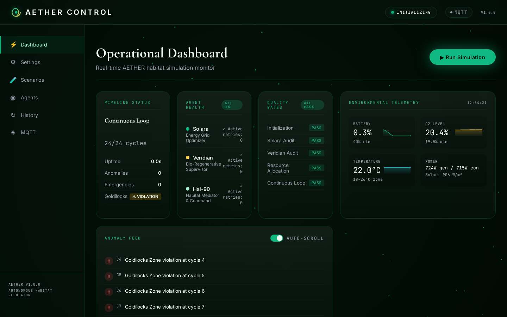
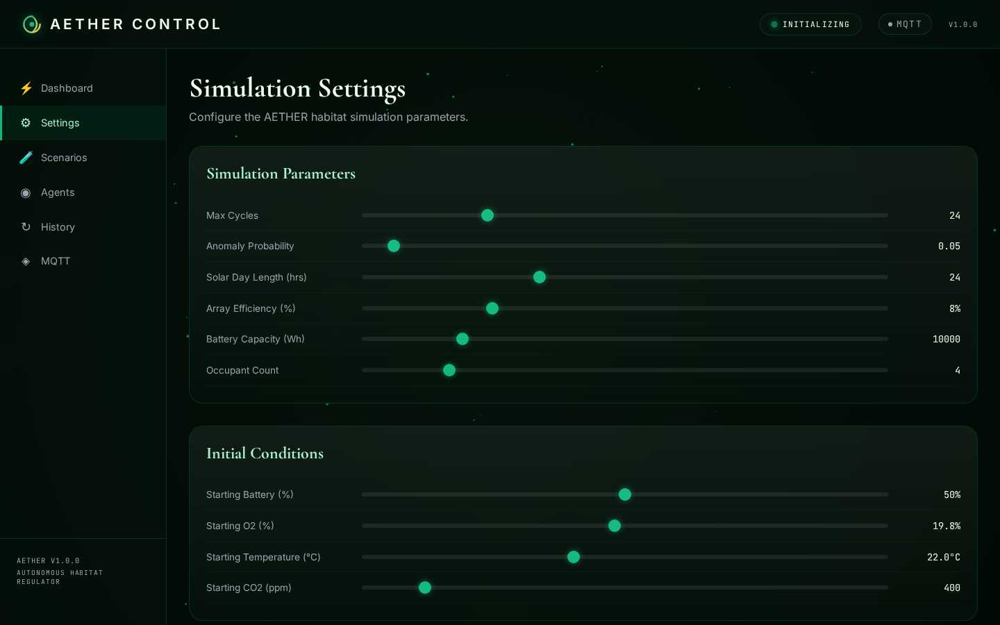
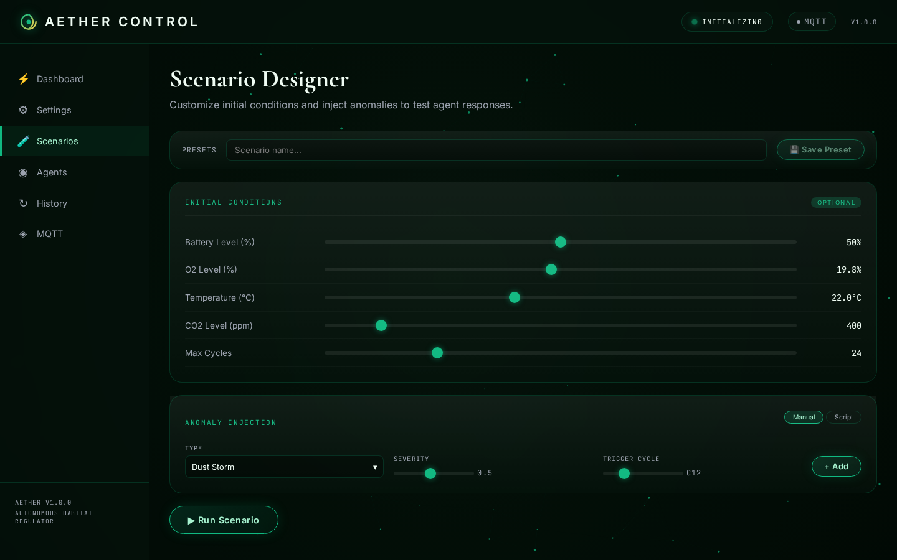
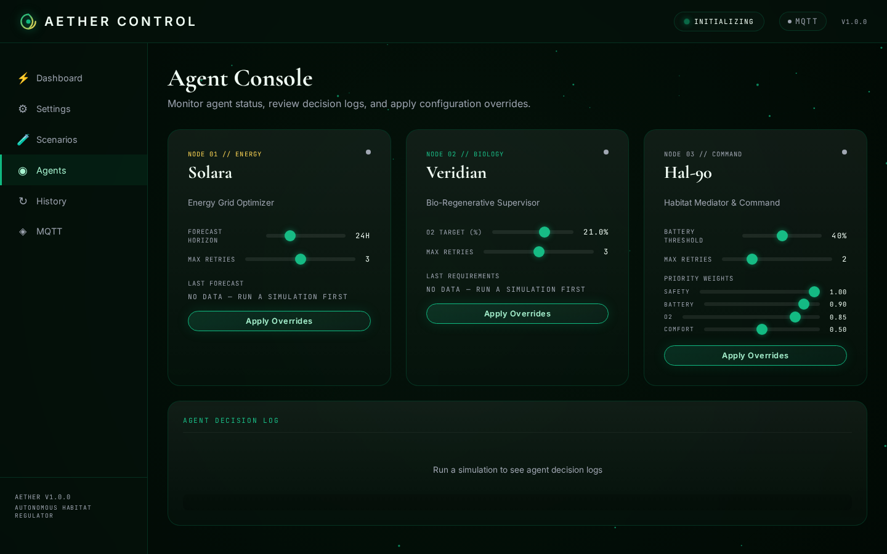
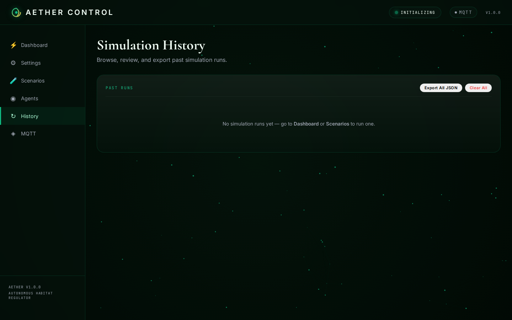
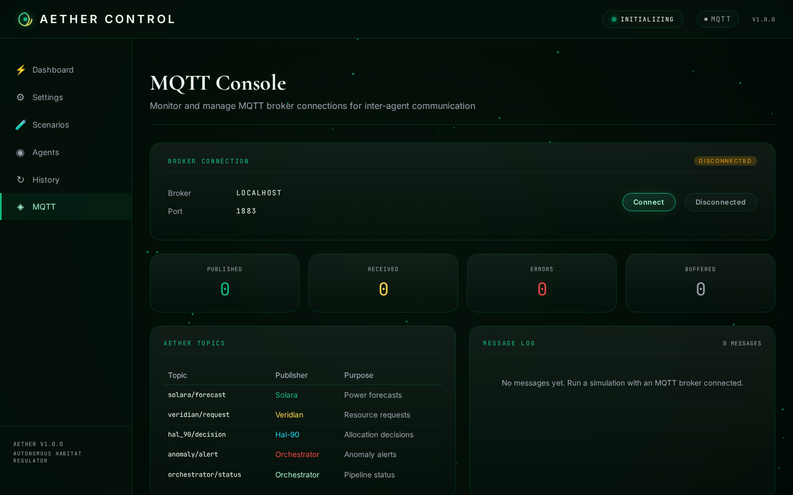

# AETHER — Autonomous Environmental & Thermal Habitat Efficiency Regulator

> **Multi-agent orchestration framework for autonomous habitat management in extreme environments.**

AETHER coordinates three specialized AI agents — **Solara** (energy), **Veridian** (bio-regenerative), **Hal-90** (mediation) — through a SimPy-powered simulation pipeline with quality gates, anomaly response, and a full web dashboard.

---

## Showcase

| Dashboard (live) | Settings |
|:---:|:---:|
|  |  |

| Scenarios & Anomaly Designer | Agent Console |
|:---:|:---:|
|  |  |

| Cycle History & Replay | MQTT Console |
|:---:|:---:|
|  |  |

---

## Quick Start

```bash
pip install aether-sim
# or with dashboard: pip install "aether-sim[dashboard]"

# CLI — run a 24-cycle simulation
aether --no-mqtt --cycles 24

# Or run the web dashboard directly
python src/dashboard.py
# → http://localhost:8000
```

**Requirements:** Python 3.11+, MQTT broker (optional — use `--no-mqtt`).

---

## Architecture

```
┌─────────────────────────────────────────────────────────────┐
│                    Agents Orchestrator                        │
│  Pipeline manager — coordinates handoffs, enforces gates,    │
│  manages retry & escalation                                  │
└────────────────────┬────────────────────────────────────────┘
                     │
        ┌────────────┼────────────┐
        │            │            │
        ▼            ▼            ▼
┌──────────────┐ ┌──────────────┐ ┌──────────────┐
│   Solara     │ │   Veridian   │ │   Hal-90     │
│  (Energy)    │ │  (Bio-Regen) │ │  (Mediator)  │
└──────┬───────┘ └──────┬───────┘ └──────┬───────┘
       │                │                │
       └────────────────┼────────────────┘
                        │
                 ┌──────▼──────┐
                 │  SimPy +    │
                 │  MQTT       │
                 └─────────────┘
```

### Agents

| Agent | Role | Behavior |
|-------|------|----------|
| **🌞 Solara** | Energy Grid Optimizer | Maximise solar intake, keep battery >40%. Conservative fallback on low confidence. |
| **🌿 Veridian** | Bio-Regenerative Supervisor | Regulate O₂/CO₂, hydroponic delivery. Prioritises "Green Lung" over non-essential loads. |
| **🤖 Hal-90** | Habitat Mediator & Command | Resolves Solara↔Veridian conflicts. Goldilocks Zone enforcer (battery >40%, O₂ >19.5%, 18–26°C). Final override authority. |

### Pipeline (6 phases per cycle)

1. **Initialisation** — Load env, start SimPy, register agents
2. **Solara Power Audit** — Forecast 24h solar, set battery threshold (confidence gate >85%)
3. **Veridian Bio Audit** — Calculate O₂ requirements, request power
4. **Hal-90 Mediation** — (Conditional) Resolve if request > threshold
5. **Resource Allocation** — Execute distribution, publish via MQTT
6. **Anomaly Loop** — Detect & respond to 5 anomaly types (dust_storm, pressure_leak, o₂_drop, temperature_spike, solar_flare)

### Quality Gates

Every phase gates on pass/fail with retry logic (3/3/2 retries for Solara/Veridian/Hal-90). Failures escalate to safe fallbacks.

---

## Features

**Core Simulator**
- 24-cycle SimPy simulation with realistic solar day/night cycle
- Dynamic battery drain/charge, O₂ regulation, temperature flux
- 5 anomaly types with state-modifying emergency responses

**Web Dashboard** (FastAPI + HTMX + Alpine.js)
- Live telemetry with HTMX polling, run simulations interactively
- Parameter sweep engine with dual-axis SVG chart & stddev bands
- Cycle-by-cycle replay with play/pause/scrubber & metric cards
- Hal-90 mediation visualiser (dual-line chart + power distribution)
- Custom anomaly scripting (sandboxed Python via `exec`)
- Multi-run batch simulations with aggregate overlay charts
- Scenario presets (save/load/delete), simulation comparison
- MQTT console with topic browser & message log

**CLI**
- `aether --no-mqtt --cycles N` — standalone simulation
- `--verbose` for detailed cycle logging

---

## Project Structure

```
aether/
├── src/
│   ├── main.py              # CLI entrypoint
│   ├── orchestrator.py      # Pipeline manager
│   ├── sim_engine.py        # SimPy simulation
│   ├── dashboard.py         # FastAPI web dashboard
│   ├── mqtt_client.py       # MQTT layer
│   └── agents/              # Agent implementations
│       ├── solara.py
│       ├── veridian.py
│       └── hal_90.py
├── tests/
│   └── test_basic.py        # Smoke tests
├── assets/screenshots/      # Dashboard screenshots
├── .github/workflows/       # CI + smoke test
├── requirements.txt
├── pyproject.toml            # pip-installable package
└── .env.example
```

---

## Configuration

Copy `.env.example` → `.env` and adjust:

| Variable | Default | Description |
|----------|---------|-------------|
| `SIMULATION_SPEED` | 1.0 | Simulation speed multiplier |
| `SOLAR_DAY_LENGTH` | 24 | Hours in a solar day |
| `ANOMALY_PROBABILITY` | 0.05 | Per-cycle anomaly chance |
| `SOLAR_ARRAY_EFFICIENCY` | 8 | Solar panel efficiency % |
| `BATTERY_CAPACITY` | 10000 | Wh |
| `SOLARA_FORECAST_HORIZON` | 24 | Forecast window (hours) |
| `VERIDIAN_O2_TARGET` | 21.0 | Target O₂ % |
| `HAL_90_BATTERY_THRESHOLD` | 40.0 | Critical battery % |

---

## Testing

```bash
python -m pytest tests/ -v
# or with coverage:
python -m pytest tests/ --cov=src --cov-report=term
```

---

## License

MIT — see [LICENSE](LICENSE). Orchestrator Pro tier requires a commercial license.

---

**AETHER v1.0.0** — *Autonomous habitat management for the extreme environments of tomorrow.*
